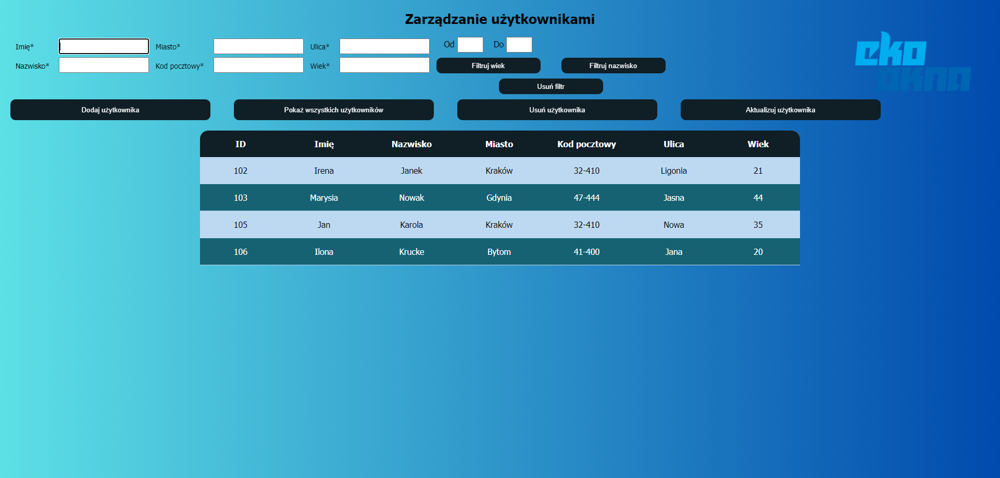

# User management
A simple Java Script project for user management
## General info
This project is my first project after a 10-year break from programming and was created for recruitment purposes.
## Technologies
- Java Script
- CSS3
- HTML5
## Setup
The project is located at this address: https://magdakrueger.github.io/Users/
You can also run project in local -> Go to the folder when you saved project, find index.html and open it in browser.
## Description
You can manage useres from https://fronttest.ekookna.pl/
- You can add new user
- Delete the selected user
- Update user
- View all users
- You can also search for a user by last name and filter all users by age
## For the future
To expand the project, can add a user search by each of its values, not just by last name.
Same with filters -> can add a filter to each value.
